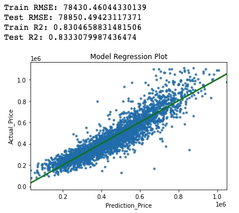
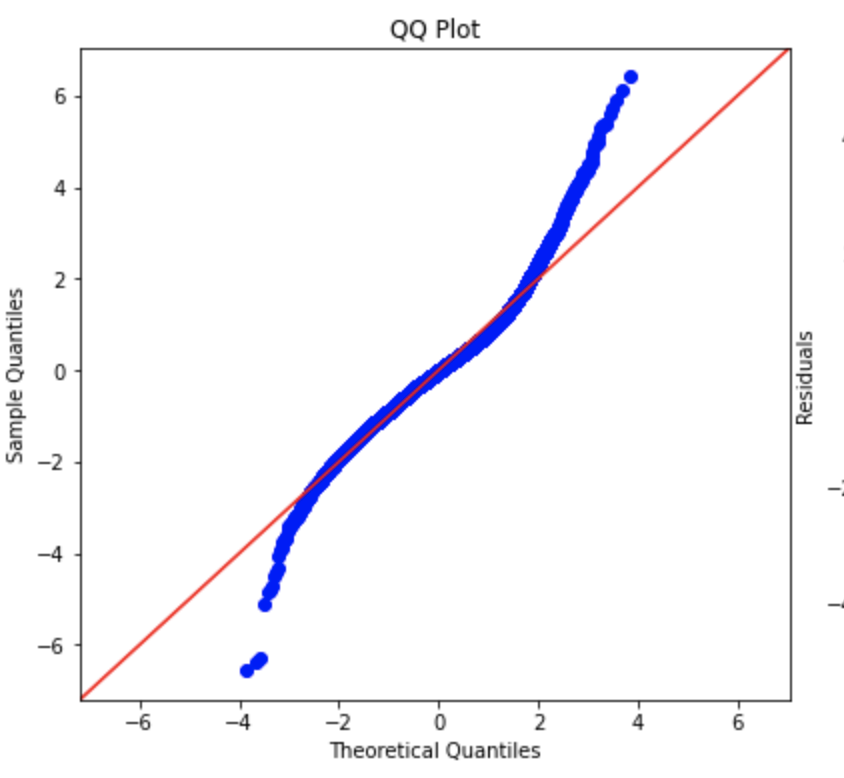
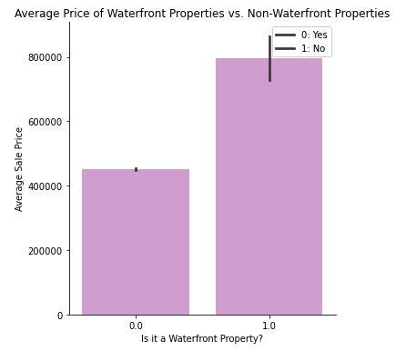
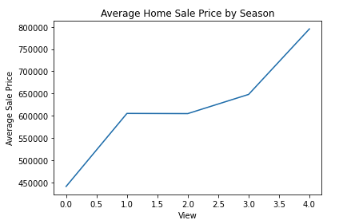
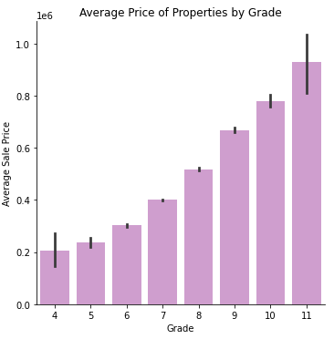

# King County House Sales Analysis
**Author**: Jennifer Ha

## Overview
This analysis project explores trends in film business to provide Microsoft with actionable recommendations as they want to enter this business as well. we will review data sets from TheNumbers.com and IMDb to determine when Microsoft should release a movie, which types of genres to consider, and whom to recruit. The methodology includes grouping, filtering, and joining and visualizing data sets to show different trends in ROI. The result shows higher ROI when Mystery, Horror, and Animation movies are released in May-July, and November-December. I recommend Microsoft to partner with lists of Top 10 actors and directors in those genres, and release movies during the summer (May-July) or holiday season (Nov-Dec).
***
## Business Problem
Star Real Estate Agency (imaginary real estate company in Seattle) is seeking advice to close deals with higher housing sales prices. In this project, we are providing analysis on what type of properties they should prioritize to acquire for their listing as well as how to attract buyers. We are creating a model to estimate the price of a home when those criterias are met. Questions to consider:
* Is a waterfront property worth more than an inland property?
* Does the number of viewings to potential buyers affect the housing price?
* Does the King County grading system affect the housing price?
***
## Data
The dataset consists of ~21600 rows of real estate transactions from King County, Seattle (WA) from 2014-2015. The columns represent different features associated with each property, which are outlined below. The target variable is the price of the property, which will be used in our models to determine the winning model, along with features that have strong relationships with it.

### Columns
* `bedrooms`: number of bedrooms
* `bathrooms`: number of bathrooms
* `sqft_living`: Square Foot Living Space
* `sqft_lot`: Square Foot of Lot
* `floors`: number of floors
* `sqft_lot15`: Square Footage of nearest 15 lots
* `has_been_renovated`: House has been renovated before
* `ratio_15`: Ratio of sqft_living to sqft_living15
* `waterfront`: Is a waterfront property
* `grade`: King County Building Grade
* `sqft_above`: Above Ground Square Footage
* `yr_built`: Year building was built
* `years_old`: Age of the building in years
* `condition`: Condition of the house
***
## Methods
Prior to iterating regression models and predictions, I conducted some exploratory data analyses to clean up the data using IQR method to prepare it for modeling, and went through several iterations to refine the model.
***
## Results
I created several multiple linear regression models, and the best-performing was Model 3 which I used feature engineering (One Hot Encoding). The model and the exploratory data analysis while preparing the data showed that `waterfront`, `grade`, and `view` are the strongest predictors of the housing price. 

### Secure waterfront properties when available!
While there are not that many, our analysis shows that a waterfront property can be worth $344,597 more than an inland property on average.

### Advertise and show the properties to many people!
Overall, the analysis shows that the housing prices increase when more groups of people get the tour. On average, houses with the most number of viewings were sold at a price $354,748 more than houses with 0 views. 

### Grading matters!
Higher grades yield higher housing prices. I recommend the team to avoid including low grade properties as the sales price increases with higher grade.

***
## Conclusions
Our winning model (Model 3) has an R squared value of 0.831, indicating that the model is capable of explaining 83.1% of the variability in a property's price.From this analysis, we can conclude that `waterfront`, `grade`, and `view` are features that have strong relationship with the target variable (`price`). Model 3 combined with EDA performed in the above led to below three recommendations.

**1. Secure waterfront properties when available.** While there are not that many, our analysis shows that a waterfront property can be worth $344,597 more than an inland property on average. There were only 146 waterfront properties to begin with in the data set, which consists of 0.80% of the total transactions. Given that acquiring a waterfront property is quite rare and a waterfront property can be worth a lot more, I recommend the team to prioritize acquiring waterfront properties to their listings. 

**2. Advertise and show the properties to many people.** It was very evident from our analysis that the housing price has a direct relationship with the number of viewings to potential buyers. I highly recommend advertising each property if possible, and creating a small "competition" will definitely help.

**3. Grading matters.** Higher grades yield higher housing prices. I recommend the team to avoid including low grade properties as the sales price increases with higher grade. This will provide the team with opportunities to close deals in their/seller's favor.
***
## For More Information
See the full analysis in the [Jupyter Notebook](http://localhost:8888/notebooks/King%20County%20House%20Sales%20Analysis.ipynb) or review this [presentation](https://github.com/jennifernha/King-County-House-Sales/blob/main/Presentation.pdf).
For additional info, contact Jennifer Ha at jnha1119@gmail.com
***
## Repository Structure
├── data 
├── images                        
├── King County House Sales Analysis.ipynb   
├── Prensentation.pdf 
├── README.md                                   
└── functions.py 
  
 