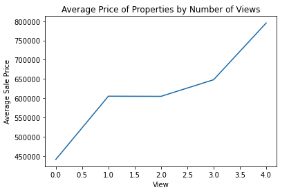

# King County House Sales Analysis
**Author**: Jennifer Ha

## Overview
This project analyzes house sales data in King County in Seattle from 2014-2015, which consists of ~21,600 transactions. Through some exploratory data analyses and iterative regression models, we will identify some features that have the strongest relationship with price.. The result shows that the model with feature engineering was the best-performing model, also revealing that waterfront properties, more viewings to potential buyers, and higher grading using King County grading system have the biggest impact on house prices.
***
## Business Problem
Star Real Estate Agency (imaginary real estate company in Seattle) is seeking advice to close deals with higher housing sales prices. In this project, we are providing analysis on which features can bring more monetary value as well as strategy. We are also creating a model to estimate the price of a home when those criterias are met. Questions to consider:
* Is a waterfront property worth more than an inland property?
* Does the number of viewings to potential buyers affect the housing price?
* Does the King County grading system affect the housing price?
***
## Data
The dataset consists of ~21,600 rows of real estate transactions from King County, Seattle (WA) from 2014-2015. The columns represent different features associated with each property, which are outlined below. The target variable is the price of the property, which will be used in our models to determine the winning model, along with features that have strong relationships with it.

### Columns
* `bedrooms`: number of bedrooms
* `bathrooms`: number of bathrooms
* `sqft_living`: Square Foot Living Space
* `sqft_lot`: Square Foot of Lot
* `floors`: number of floors
* `sqft_lot15`: Square Footage of nearest 15 lots
* `has_been_renovated`: House has been renovated before
* `ratio_15`: Ratio of sqft_living to sqft_living15
* `waterfront`: Is a waterfront property
* `grade`: King County Building Grade
* `sqft_above`: Above Ground Square Footage
* `yr_built`: Year building was built
* `years_old`: Age of the building in years
* `condition`: Condition of the house
***
## Methods
Prior to iterating regression models and predictions, I conducted some exploratory data analyses to clean up the data using IQR method to prepare it for modeling, and went through several iterations to refine the model.
***
## Results
I created several multiple linear regression models, and the best-performing was Model 3 which I used feature engineering (One Hot Encoding). The model and the exploratory data analysis while preparing the data showed that `sqft_living`, `grade`, and `sqft_above` are the strongest predictors of the housing price. 

### Secure waterfront properties when available!
While there are not that many, our analysis shows that a waterfront property can be worth $344,597 more than an inland property on average.

### Advertise and show the properties to many people!
Overall, the analysis shows that the housing prices increase when more groups of people get the tour. On average, houses with the most number of viewings were sold at a price $354,748 more than houses with 0 views. 

### Grading matters!
Higher grades yield higher housing prices. I recommend the team to avoid including low grade properties as the sales price increases with higher grade.

***
## Conclusions
Our winning model (Model 3) has an R squared values of 0.83, indicating that the model is capable of explaining 83% of the variability in a property's price. However, I want to point out that model 5 is also a very strong when all things considered (R squared values, Q-Q plot, and homoscedasticity plot). From this analysis, we can conclude that `sqft_living`, `grade`, and `sqft_above` are features that have strong relationship with the target variable (`price`). Model 3 combined with EDA performed in the above led to below three recommendations.

**1. It's all about the size!** Expectedly, our analysis shows that the space of a property matters the most and will add the most value to the house sales price. While having a variety of listings to satisfy different buyers, it would be the best to prioritize buyers looking for a house for their family.

**2. Larger living space apart from basement!** While the overall size of space matters, it is more imperative to have larger space above the ground.

**3. Secure waterfront properties when available!** While there are not that many, our analysis shows that a waterfront property can be worth $344,597 more than an inland property on average. There were only 146 waterfront properties to begin with in the data set, which consists of 0.80% of the total transactions. Given that acquiring a waterfront property is quite rare and a waterfront property can be worth a lot more, I recommend the team to prioritize acquiring waterfront properties to their listings. 

**4. Advertise and show the properties to many people!** It was very evident from our analysis that the housing price has a direct relationship with the number of viewings to potential buyers. I highly recommend advertising each property if possible, and creating a small "competition" will definitely help.

**5. Grading matters!** Higher grades yield higher housing prices. I recommend the team to avoid including low grade properties as the sales price increases with higher grade. This will provide the team with opportunities to close deals in their/seller's favor.
***
## For More Information
See the full analysis in the [Jupyter Notebook](http://localhost:8888/notebooks/King%20County%20House%20Sales%20Analysis.ipynb) or review this [presentation](https://github.com/jennifernha/King-County-House-Sales/blob/main/Presentation.pdf).
For additional info, contact Jennifer Ha at jnha1119@gmail.com
***
## Repository Structure
├── data 
├── images                        
├── King County House Sales Analysis.ipynb   
├── Presentation.pdf                   
├── README.md                                    
└── functions.py 
  